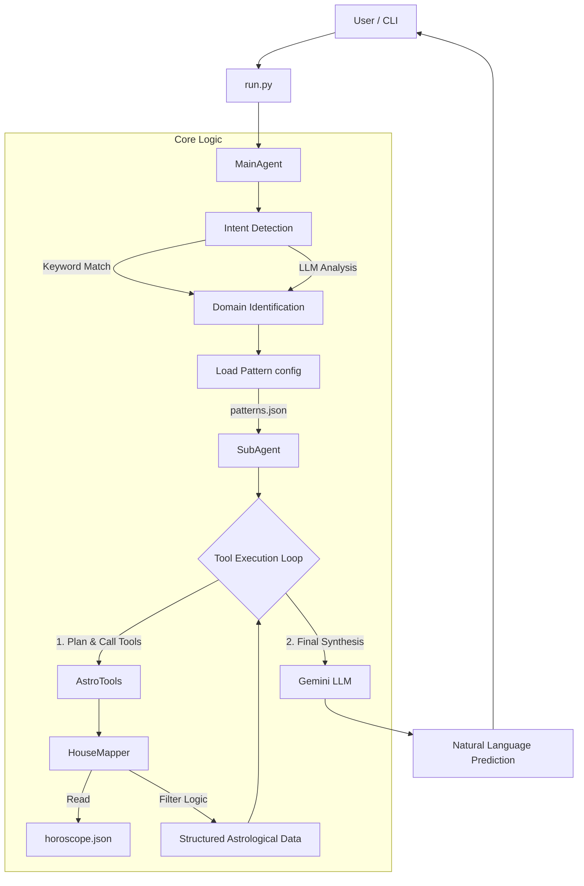

# AstroEngine 2.0 - Architecture and System Design Report

## Executive Summary
AstroEngine 2.0 is a comprehensive Vedic Astrology reasoning engine designed with a multi-agent modular architecture. It implements a sophisticated pipeline that transforms user queries into astrological insights using classical rules and Large Language Model (LLM) synthesis. The system is built in Python and leverages Google's Gemini models for intent detection and natural language generation.

## System Architecture Diagram

## Component Analysis

### 1. Entry Point: `run.py`
The CLI entry point handling user interaction and system initialization.
- **Responsibilities**:
  - Validates environment (API keys).
  - Manages argument parsing (query input, file paths).
  - Handles horoscope management (loading existing files or triggering generation via `HoroscopeManager`).
  - Displays formatted output and execution metrics (tokens, cost, time).

### 2. Orchestrator: `main_agent.py`
The central controller that manages the high-level workflow.
- **Intent Detection**:
  - **Primary**: Keyword matching against `patterns.json` for zero-latency detection.
  - **Secondary**: Fallback to LLM (`GeminiLLM`) to semantically classify complex queries into domains (e.g., "Dating", "Career", "Health").
- **Workflow**:
  1. Identifies the query domain.
  2. Loads the corresponding analysis pattern.
  3. Delegates the detailed analysis to `SubAgent`.
  4. Aggregates metrics and returns the final response.

### 3. Analyzer: `sub_agent.py`
The "brain" of the astrological analysis, implementing an agentic tool-use pattern.
- **Architecture**: multi-turn LLM conversation loop (up to 10 turns).
- **Process**:
  1. Receives the user query and domain-specific context.
  2. Dynamically decides which data retrieval tools to call.
  3. Synthesizes the retrieved data into a final prediction.
- **Key Features**:
  - **Tool Use**: Instead of dumping all data into the context, it selectively calls tools like `get_house_data`, `get_planet_details`, or `get_divisional_chart_ascendant`.
  - **Fallback**: Includes a robust fallback mechanism to "simple analysis" if API rate limits are hit.

### 4. Data Extraction: `house_mapper.py` & `patterns.json`
A highly configurable data layer that ensures the LLM only sees relevant information, reducing context noise and cost.
- **`patterns.json`**: The configuration heart. Defines 9 domains (Dating, Marriage, Career, etc.).
  - **Structure**:
    - `description`: LLM prompt context.
    - `focus_houses`: Which houses are relevant (e.g., 5, 7 for Dating).
    - `focus_planets`: Relevant planets (e.g., Venus, Mars).
    - `required_charts`: Divisional charts to load (e.g., D1, D9).
- **`house_mapper.py`**: The "query engine" for the horoscope JSON.
  - Takes a pattern definition and extracts *only* the specific houses, planets, and charts requested.
  - Handles complex logic like identifying Vargottama planets, combustion, and extracting Panchanga.

### 5. Infrastructure & Utilities
- **`horoscope_manager.py`**: Facade for the underlying calculation engine (`generate_horoscope.py`).
- **`llm_interface.py`**: Wrapper for Google Gemini API, handling JSON generation and tool calls.
- **`logger_config.py`**: Centralized logging configuration for debugging and audit trails.

## Data Flow Description

1. **Initialization**: System loads `horoscope.json` (a massive JSON dump of astronomical data).
2. **Query**: User asks "Will I get married soon?".
3. **Intent**: `MainAgent` detects "Marriage" intent.
4. **Pattern Loading**: System loads "marriage" pattern from `patterns.json` (Focus: Houses 1, 7, 8; Planets: Venus, Jupiter; Charts: D1, D9).
5. **Agentic Analysis**:
   - `SubAgent` starts. It might deduce "I need to check the 7th house in D9."
   - Calls `get_house_data(chart='D9', house=7)`.
   - `HouseMapper` executes this precise lookup.
   - `SubAgent` receives the data (e.g., "Mars is in 7th house D9").
   - `SubAgent` synthesizes this with rules: "Mars in 7th can indicate conflict."
6. **Response**: The final insight is formatted into a user-friendly prediction.

## Design Patterns & Best Practices Observations
- **Separation of Concerns**: Clear distinction between orchestration (`MainAgent`), domain logic (`patterns.json`), and execution (`SubAgent`).
- **Configuration-Driven Design**: New astrological domains can be added solely by editing `patterns.json` without changing code.
- **Agentic Tool Use**: Optimizes token usage by fetching data on-demand rather than context-stuffing.
- **Robustness**: Error handling and retry logic (rate limit fallbacks) are well-integrated.
